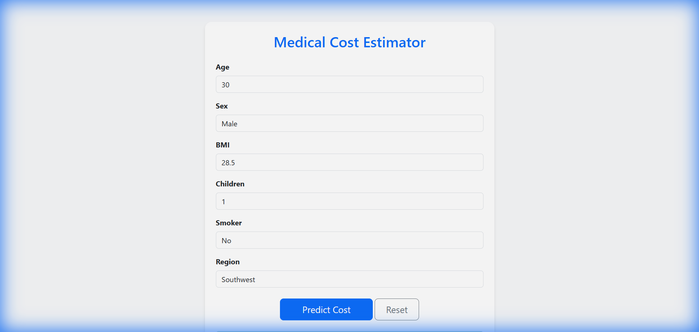

# Medical Cost Prediction

A Django web application that predicts individual medical costs using a Linear Regression model trained on demographic and health data.



## Features
- **Machine Learning**: Uses a trained Linear Regression model (`model_linear_reg.pkl`).
- **Web Interface**: User-friendly form built with Django and Bootstrap 5.
- **Data Analysis**: Includes EDA scripts and visualizations.

## Project Structure
- `insurance_project/`: Django project settings.
- `predictor/`: Django app containing views, forms, and templates.
- `eda_analysis.py`: Script for Exploratory Data Analysis.
- `train_model.py`: Script to train and save the model.
- `insurance.csv`: Dataset (dummy data).
- `requirements.txt`: Python dependencies.

## Setup & Installation

1. **Clone the repository** (or navigate to the directory).

2. **Create and activate a virtual environment** (optional but recommended):
   ```bash
   python -m venv venv
   # Windows
   venv\Scripts\activate
   # Linux/Mac
   source venv/bin/activate
   ```

3. **Install dependencies**:
   ```bash
   pip install -r requirements.txt
   ```

4. **Run Migrations**:
   ```bash
   python manage.py migrate
   ```

## Usage

1. **Start the development server**:
   ```bash
   python manage.py runserver
   ```

2. **Open browser**:
   Navigate to `http://127.0.0.1:8000/`.

3. **Predict**:
   Enter Age, Sex, BMI, Children, Smoker status, and Region to get an estimated insurance cost.

## License
MIT